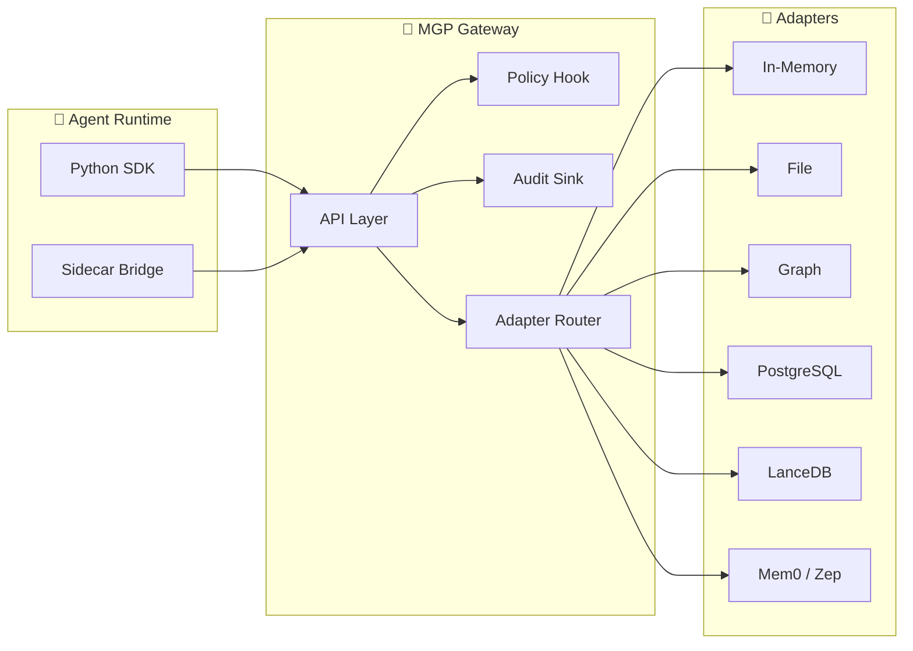

<div align="center">

# 🧠 MGP — Memory Governance Protocol

**The open protocol for governed memory in AI systems.**

[](#)
[](LICENSE)
[](https://github.com/hkuds/MGP/actions)
[](https://hkuds.github.io/MGP/)
[](#)

[English](README.md) · [简体中文](README.zh.md) · [Documentation](https://hkuds.github.io/MGP/) · [Getting Started](docs/getting-started.md)

</div>

---

MGP standardizes how AI runtimes **write, recall, govern, and audit persistent memory** across heterogeneous backends. Think of it as a unified contract layer — your agent talks to one protocol, and any compliant memory backend just works.

Current protocol version: `v0.1.1`

> **MCP** standardizes *tools and resources*. **MGP** standardizes *governed memory*. They are peer protocols — complementary, not competing.

## 🏗️ Architecture



## ✨ Why MGP?

| | |
|---|---|
| 📐 **One Protocol, Any Backend** | Write once, connect to in-memory, file, graph, relational, vector, or managed memory services |
| 🔒 **Governance Built-In** | Every request carries policy context — who acts, for whom, under what constraints |
| 🔄 **Full Lifecycle** | Write → Search → Get → Update → Expire → Revoke → Delete → Purge — each with distinct semantics |
| 📋 **Audit Trail** | Every state transition is recorded. Query the audit log through the protocol itself |
| 🧩 **Pluggable Adapters** | Ship your own adapter or pick from 7 reference implementations |
| 🤝 **Peer to MCP** | Complements MCP — use MCP for tools, MGP for memory, both in the same runtime |
| ✅ **Compliance Suite** | Machine-verifiable conformance profiles: `Core`, `Lifecycle`, `Interop`, `ExternalService` |
| 📄 **Schema-Driven** | 60+ JSON Schemas + OpenAPI spec — validate everything, guess nothing |

## 🚀 Quick Start

Get a governed memory gateway running in under 2 minutes:

```bash
git clone https://github.com/hkuds/MGP.git
cd MGP
make install    # creates .venv/ and installs everything
make serve      # starts the gateway at http://127.0.0.1:8080
```

Verify it's running:

```bash
curl http://127.0.0.1:8080/mgp/capabilities
```

**Write your first memory:**

```bash
curl -X POST http://127.0.0.1:8080/mgp/write \
  -H "Content-Type: application/json" \
  -d '{
    "request_id": "req_001",
    "policy_context": {
      "actor_agent": "my-agent/v1",
      "acting_for_subject": {"kind": "user", "id": "user_alice"},
      "requested_action": "write",
      "tenant_id": "my_tenant"
    },
    "payload": {
      "memory": {
        "memory_id": "mem_001",
        "subject": {"kind": "user", "id": "user_alice"},
        "scope": "user",
        "type": "preference",
        "content": {
          "statement": "User prefers dark mode.",
          "preference_key": "theme",
          "preference_value": "dark"
        },
        "source": {"kind": "human", "ref": "chat:1"},
        "sensitivity": "internal",
        "created_at": "2026-01-01T00:00:00Z",
        "backend_ref": {"tenant_id": "my_tenant"},
        "extensions": {}
      }
    }
  }'
```

**Search it back:**

```bash
curl -X POST http://127.0.0.1:8080/mgp/search \
  -H "Content-Type: application/json" \
  -d '{
    "request_id": "req_002",
    "policy_context": {
      "actor_agent": "my-agent/v1",
      "acting_for_subject": {"kind": "user", "id": "user_alice"},
      "requested_action": "search",
      "tenant_id": "my_tenant"
    },
    "payload": {
      "query": "dark mode",
      "limit": 10
    }
  }'
```

**Or use the Python SDK:**

```python
from mgp_client import MGPClient, PolicyContextBuilder, SearchQuery

ctx = PolicyContextBuilder(
    actor_agent="my-agent/v1",
    subject_id="user_alice",
    tenant_id="my_tenant",
)

with MGPClient("http://127.0.0.1:8080") as client:
    client.write_memory(
        ctx.build("write"),
        {
            "memory_id": "mem_001",
            "subject": {"kind": "user", "id": "user_alice"},
            "scope": "user",
            "type": "preference",
            "content": {"statement": "User prefers dark mode."},
            "source": {"kind": "human", "ref": "chat:1"},
            "created_at": "2026-01-01T00:00:00Z",
            "backend_ref": {"tenant_id": "my_tenant"},
            "extensions": {},
        },
    )

    results = client.search_memory(
        ctx.build("search"),
        SearchQuery(query="dark mode", limit=10),
    )
    for item in results.data.get("results", []):
        print(item["consumable_text"])
```

> 📖 For the complete walkthrough — including update, expire, and audit — see the **[Getting Started Guide](docs/getting-started.md)**.

## 📂 Repository Map

```
MGP/
├── spec/           # 📜 Protocol semantics — the source of truth
├── schemas/        # 📐 60+ JSON Schemas for all protocol objects
├── openapi/        # 🌐 OpenAPI definition (HTTP binding)
├── reference/      # ⚙️ Python reference gateway (FastAPI)
├── adapters/       # 🧩 Backend adapter implementations
├── sdk/python/     # 📦 MGPClient + AsyncMGPClient + helpers
├── compliance/     # ✅ Executable conformance test suite
├── integrations/   # 🔌 Runtime bridges (Nanobot, LangGraph, minimal)
├── examples/       # 💡 Runnable end-to-end demos
└── docs/           # 📖 MkDocs documentation site (EN + ZH)
```

## 🧩 Adapter Ecosystem

| Adapter | Backend | Profile | Use Case |
|---------|---------|---------|----------|
| [**In-Memory**](adapters/memory/README.md) | Process memory | Reference | Testing & development |
| [**File**](adapters/file/README.md) | JSON files | Reference | File-native workflows |
| [**Graph**](adapters/graph/README.md) | SQLite | Reference | Relationship semantics |
| [**PostgreSQL**](adapters/postgres/README.md) | PostgreSQL | Production | Relational backends |
| [**LanceDB**](adapters/lancedb/README.md) | LanceDB | Production | Vector / hybrid search |
| [**Mem0**](adapters/mem0/README.md) | Mem0 service | External | Managed memory |
| [**Zep**](adapters/zep/README.md) | Zep service | External | Graph-native memory |

> Reference adapters are for protocol verification and learning. For production, use the PostgreSQL/LanceDB baselines or [build your own](docs/adapter-guide.md).

## ⚖️ MGP vs MCP

| Dimension | MCP | MGP |
|-----------|-----|-----|
| **Focus** | Tools & resource connectivity | Governed persistent memory |
| **Protocol surface** | Tool invocation, resource discovery | Memory CRUD, policy, audit, lifecycle |
| **Data model** | Tools, prompts, resources | Memory objects, candidates, recall intents |
| **Governance** | Not in scope | Policy context, access control, retention |
| **Audit** | Not in scope | Built-in audit trail & lineage |
| **Relationship** | Peer protocol | Peer protocol |

**One-line heuristic:** Use **MCP for action**, use **MGP for memory**.

Both can coexist in the same runtime — call a calendar tool via MCP, remember the user's scheduling preferences via MGP.

> 📖 Deep dive: [MGP vs MCP](docs/mgp-vs-mcp.md)

## 🧭 Where to Start

Choose your path:

| You are... | Start here |
|-----------|------------|
| 🛠️ **Runtime developer** | [Getting Started](docs/getting-started.md) → [Python SDK](sdk/python/README.md) → [Sidecar Integration](docs/sidecar-integration.md) |
| 🏢 **Platform engineer** | [Reference Implementation](docs/reference-implementation.md) → [Deployment Guide](docs/deployment-guide.md) → [Security Baseline](docs/security-baseline.md) |
| 📐 **Protocol implementer** | [Protocol Reference](docs/protocol-reference.md) → [Schema Reference](docs/schema-reference.md) → [Spec Index](spec/README.md) |
| 🧩 **Adapter author** | [Adapter Guide](docs/adapter-guide.md) → [Adapters Overview](docs/adapters-overview.md) → [Compliance Suite](docs/compliance-suite.md) |

## 🔬 Protocol Surface

Core operations:

```
WriteMemory · SearchMemory · GetMemory · UpdateMemory
ExpireMemory · RevokeMemory · DeleteMemory · PurgeMemory
BatchWrite · AuditQuery
```

Discovery & lifecycle:

```
GET /mgp/capabilities · POST /mgp/initialize
Export · Import · Sync · Task polling & cancellation
```

Operational:

```
GET /healthz · GET /readyz · GET /version
```

## 🤝 Contributing

We welcome contributions! See [CONTRIBUTING.md](CONTRIBUTING.md) for the development workflow.

```bash
make install          # set up the dev environment
make lint             # contract validation + code quality
make test-all         # compliance suite on all reference adapters
make docs-build       # verify documentation builds
```

## 📄 License

MGP is released under the [MIT License](LICENSE).
