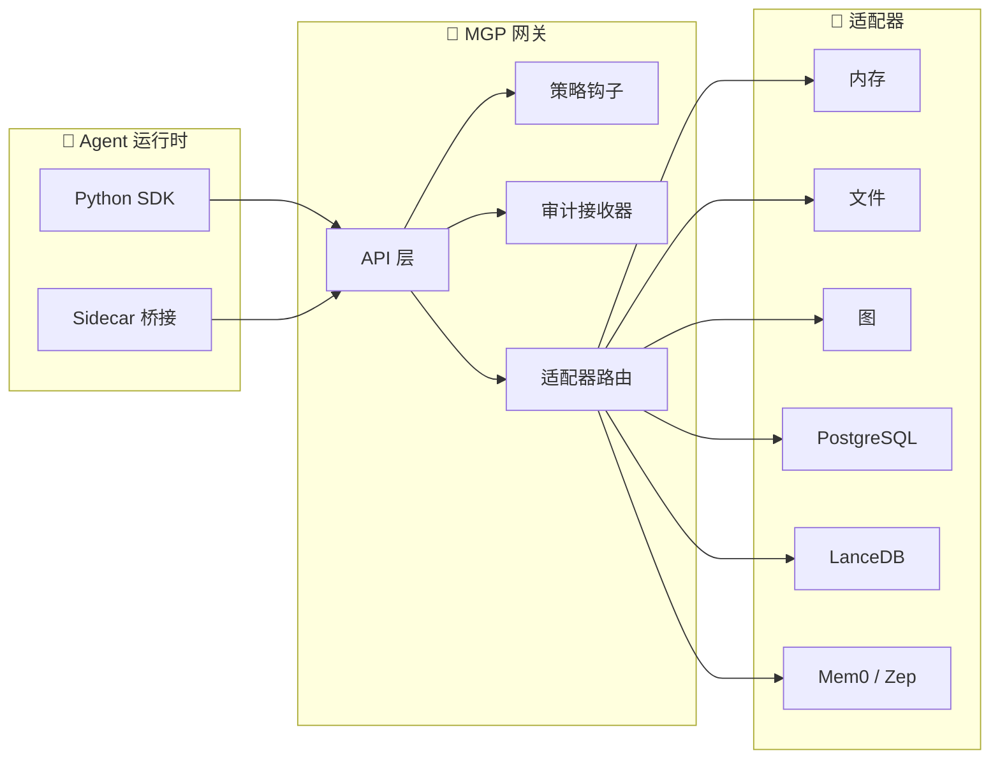

<div align="center">

# 🧠 MGP — Memory Governance Protocol

**面向 AI 系统的开放记忆治理协议**

[](#)
[](LICENSE)
[](https://github.com/hkuds/MGP/actions)
[](https://hkuds.github.io/MGP/)
[](#)

[English](README.md) · [简体中文](README.zh.md) · [文档站](https://hkuds.github.io/MGP/) · [快速入门](docs/zh/getting-started.md)

</div>

---

MGP 统一了 AI 运行时**写入、召回、治理和审计持久化记忆**的方式。它是一个协议契约层——你的 Agent 只需对接一套协议，任何兼容的记忆后端都能直接工作。

当前协议版本：`v0.1.0`

> **MCP** 标准化的是*工具与资源*。**MGP** 标准化的是*受治理记忆*。二者是对等协议——互补而非竞争。

## 🏗️ 架构



## ✨ 为什么需要 MGP？

| | |
|---|---|
| 📐 **一套协议，多种后端** | 对接一次，即可连通内存、文件、图、关系型、向量、托管记忆服务等多种后端 |
| 🔒 **治理内建** | 每个请求都携带策略上下文——谁在操作、为谁操作、在什么约束下 |
| 🔄 **完整生命周期** | Write → Search → Get → Update → Expire → Revoke → Delete → Purge，每步都有明确语义 |
| 📋 **审计追踪** | 每次状态变更都有记录，可通过协议本身查询审计日志 |
| 🧩 **可插拔适配器** | 自建适配器，或选用 7 个参考实现之一 |
| 🤝 **与 MCP 对等** | 与 MCP 互补——MCP 管工具，MGP 管记忆，两者可在同一运行时共存 |
| ✅ **合规套件** | 机器可验证的兼容性配置档：`Core`、`Lifecycle`、`Interop`、`ExternalService` |
| 📄 **Schema 驱动** | 60+ JSON Schema + OpenAPI 定义——验证一切，不靠猜测 |

## 🚀 快速上手

两分钟内启动一个受治理记忆网关：

```bash
git clone https://github.com/hkuds/MGP.git
cd MGP
make install    # 创建 .venv/ 并安装所有依赖
make serve      # 在 http://127.0.0.1:8080 启动网关
```

验证是否就绪：

```bash
curl http://127.0.0.1:8080/mgp/capabilities
```

**写入你的第一条记忆：**

```bash
curl -X POST http://127.0.0.1:8080/mgp/write \
  -H "Content-Type: application/json" \
  -d '{
    "request_id": "req_001",
    "policy_context": {
      "actor_agent": "my-agent/v1",
      "acting_for_subject": {"kind": "user", "id": "user_alice"},
      "requested_action": "write",
      "tenant_id": "my_tenant"
    },
    "payload": {
      "memory": {
        "memory_id": "mem_001",
        "subject": {"kind": "user", "id": "user_alice"},
        "scope": "user",
        "type": "preference",
        "content": {
          "statement": "用户偏好暗色模式。",
          "preference_key": "theme",
          "preference_value": "dark"
        },
        "source": {"kind": "human", "ref": "chat:1"},
        "sensitivity": "internal",
        "created_at": "2026-01-01T00:00:00Z",
        "backend_ref": {"tenant_id": "my_tenant"},
        "extensions": {}
      }
    }
  }'
```

**搜索召回：**

```bash
curl -X POST http://127.0.0.1:8080/mgp/search \
  -H "Content-Type: application/json" \
  -d '{
    "request_id": "req_002",
    "policy_context": {
      "actor_agent": "my-agent/v1",
      "acting_for_subject": {"kind": "user", "id": "user_alice"},
      "requested_action": "search",
      "tenant_id": "my_tenant"
    },
    "payload": {
      "query": "dark mode",
      "limit": 10
    }
  }'
```

**或使用 Python SDK：**

```python
from mgp_client import MGPClient, PolicyContextBuilder, SearchQuery

ctx = PolicyContextBuilder(
    actor_agent="my-agent/v1",
    subject_id="user_alice",
    tenant_id="my_tenant",
)

with MGPClient("http://127.0.0.1:8080") as client:
    client.write_memory(
        ctx.build("write"),
        {
            "memory_id": "mem_001",
            "subject": {"kind": "user", "id": "user_alice"},
            "scope": "user",
            "type": "preference",
            "content": {"statement": "用户偏好暗色模式。"},
            "source": {"kind": "human", "ref": "chat:1"},
            "created_at": "2026-01-01T00:00:00Z",
            "backend_ref": {"tenant_id": "my_tenant"},
            "extensions": {},
        },
    )

    results = client.search_memory(
        ctx.build("search"),
        SearchQuery(query="dark mode", limit=10),
    )
    for item in results.data.get("results", []):
        print(item["consumable_text"])
```

> 📖 完整教程（包括更新、过期、审计等）请参阅 **[快速入门指南](docs/zh/getting-started.md)**。

## 📂 仓库导览

```
MGP/
├── spec/           # 📜 协议语义——真正的规范源
├── schemas/        # 📐 60+ JSON Schema，覆盖所有协议对象
├── openapi/        # 🌐 OpenAPI 定义（HTTP 绑定）
├── reference/      # ⚙️ Python 参考网关（FastAPI）
├── adapters/       # 🧩 后端适配器实现
├── sdk/python/     # 📦 MGPClient + AsyncMGPClient + 辅助工具
├── compliance/     # ✅ 可执行合规测试套件
├── integrations/   # 🔌 运行时桥接（Nanobot、LangGraph、minimal）
├── examples/       # 💡 可运行的端到端示例
└── docs/           # 📖 MkDocs 文档站（中 + 英）
```

## 🧩 适配器生态

| 适配器 | 后端 | 定位 | 使用场景 |
|--------|------|------|---------|
| [**In-Memory**](adapters/memory/README.md) | 进程内存 | 参考 | 测试与开发 |
| [**File**](adapters/file/README.md) | JSON 文件 | 参考 | 文件型工作流 |
| [**Graph**](adapters/graph/README.md) | SQLite | 参考 | 关系语义 |
| [**PostgreSQL**](adapters/postgres/README.md) | PostgreSQL | 生产 | 关系型后端 |
| [**LanceDB**](adapters/lancedb/README.md) | LanceDB | 生产 | 向量/混合搜索 |
| [**Mem0**](adapters/mem0/README.md) | Mem0 服务 | 外部 | 托管记忆 |
| [**Zep**](adapters/zep/README.md) | Zep 服务 | 外部 | 图原生记忆 |

> 参考适配器用于协议验证和学习。生产环境建议使用 PostgreSQL/LanceDB 基线，或按 [适配器编写指南](docs/zh/adapter-guide.md) 自建。

## ⚖️ MGP vs MCP

| 维度 | MCP | MGP |
|------|-----|-----|
| **关注点** | 工具与资源连接 | 受治理持久化记忆 |
| **协议面** | 工具调用、资源发现 | 记忆 CRUD、策略、审计、生命周期 |
| **数据模型** | 工具、提示词、资源 | 记忆对象、候选项、召回意图 |
| **治理** | 不在范围内 | 策略上下文、访问控制、保留策略 |
| **审计** | 不在范围内 | 内建审计追踪与血缘关系 |
| **关系** | 对等协议 | 对等协议 |

**一句话总结：** 用 **MCP 执行动作**，用 **MGP 管理记忆**。

两者可以在同一运行时共存——通过 MCP 调用日历工具，通过 MGP 记住用户的长期日程偏好。

> 📖 深入了解：[MGP vs MCP](docs/zh/mgp-vs-mcp.md)

## 🧭 从哪里开始

按你的角色选择路径：

| 你是... | 从这里开始 |
|---------|-----------|
| 🛠️ **Runtime 开发者** | [快速入门](docs/zh/getting-started.md) → [Python SDK](sdk/python/README.md) → [Sidecar 接入](docs/zh/sidecar-integration.md) |
| 🏢 **平台工程师** | [参考实现](docs/zh/reference-implementation.md) → [部署指南](docs/zh/deployment-guide.md) → [安全基线](docs/zh/security-baseline.md) |
| 📐 **协议实现者** | [协议参考](docs/zh/protocol-reference.md) → [Schema 参考](docs/zh/schema-reference.md) → [规范索引](spec/README.md) |
| 🧩 **适配器开发者** | [适配器指南](docs/zh/adapter-guide.md) → [适配器概览](docs/zh/adapters-overview.md) → [合规套件](docs/zh/compliance-suite.md) |

## 🔬 协议面

核心操作：

```
WriteMemory · SearchMemory · GetMemory · UpdateMemory
ExpireMemory · RevokeMemory · DeleteMemory · PurgeMemory
BatchWrite · AuditQuery
```

发现与生命周期：

```
GET /mgp/capabilities · POST /mgp/initialize
Export · Import · Sync · 任务轮询与取消
```

运维端点：

```
GET /healthz · GET /readyz · GET /version
```

## 🤝 参与贡献

欢迎贡献！详见 [CONTRIBUTING.md](CONTRIBUTING.md)。

```bash
make install          # 搭建开发环境
make lint             # 合同校验 + 代码质量检查
make test-all         # 对所有参考适配器跑合规套件
make docs-build       # 验证文档构建
```

## 📄 许可证

MGP 基于 [MIT 许可证](LICENSE) 发布。
