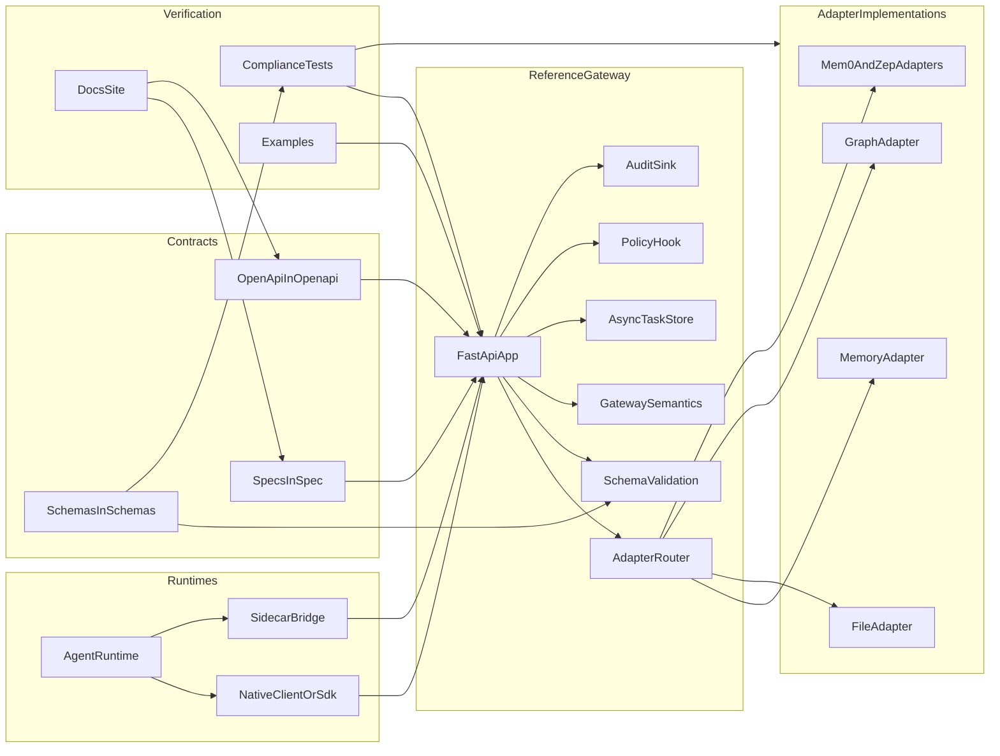
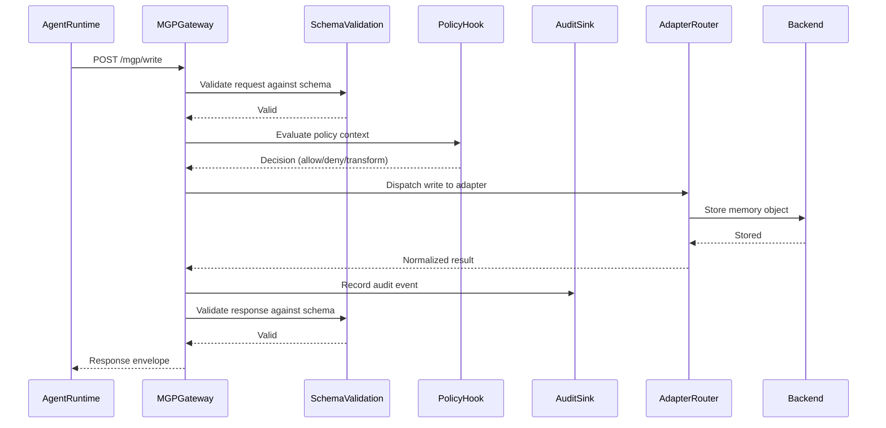

# Architecture

This page maps the MGP protocol layers to the repository directories that implement or verify them.

## Layered View

## Repository Mapping

| Layer | Repository paths | What they do |
| --- | --- | --- |
| Protocol semantics | `spec/` | define behavior, terms, and compatibility boundaries |
| Machine-readable contracts | `schemas/`, `openapi/` | define JSON validation rules and the HTTP binding surface |
| Runnable gateway | `reference/gateway/`, `reference/policy/`, `reference/audit/` | implement the reference FastAPI service, policy hook, audit sink, and async task support |
| Backend normalization | `adapters/` | normalize backend behavior into the MGP adapter contract |
| Runtime integration | `sdk/python/`, `integrations/nanobot/` | provide client-side helpers and the first runtime adoption path |
| Verification | `compliance/`, `examples/` | prove protocol behavior through tests and runnable examples |
| Reader-facing documentation | `docs/`, `README.md` | explain the system and map readers to the right source files |

## Reference Request Flow

The following sequence diagram shows how a typical `WriteMemory` request flows through the reference gateway:

Step by step:

1. A runtime calls MGP through a native client or a sidecar bridge.
2. The reference gateway validates the request against published schemas.
3. The gateway evaluates the policy context through the policy hook.
4. The adapter router dispatches the operation to the selected adapter.
5. The adapter maps the request to a concrete backend model and returns normalized results.
6. The audit sink records the operation.
7. The response is validated and returned.

## Why This Split Exists

The repository separates protocol prose, schemas, runnable code, and tests so that each concern has a clear source of truth:

- `spec/` explains what the protocol means.
- `schemas/` and `openapi/` state what valid messages look like.
- `reference/` and `adapters/` show how the protocol behaves in code.
- `compliance/` proves whether an implementation actually conforms.
