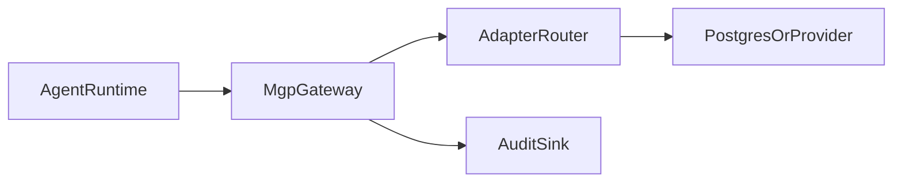

# Deployment Guide

This page summarizes the main ways to deploy the MGP reference gateway.

## Deployment Shapes

### Local Source Path

Best for:

- protocol development
- adapter authoring
- debugging reference behavior

Command:

```bash
make install
make serve
```

### Installed Package Path

Best for:

- lightweight internal deployments
- environments where you want a CLI entrypoint without cloning the whole repo workflow

Command:

```bash
python3 -m pip install .
mgp-gateway --host 127.0.0.1 --port 8080
```

### Container Path

Best for:

- demos
- local integration environments
- simple CI smoke deployments

Command:

```bash
docker compose up --build
```

## Adapter Selection

Key environment variables:

- `MGP_ADAPTER`
- `MGP_FILE_STORAGE_DIR`
- `MGP_GRAPH_DB_PATH`
- `MGP_POSTGRES_DSN`

Recommended starting points:

- `memory` for local debugging
- `file` for simple persistence demos
- `postgres` for a production-oriented self-managed baseline
- `mem0` or `zep` when the deployment already depends on those providers

## Security And Access

Key gateway options:

- `MGP_GATEWAY_AUTH_MODE`
- `MGP_GATEWAY_API_KEY`
- `MGP_GATEWAY_BEARER_TOKEN`
- `MGP_GATEWAY_TENANT_HEADER`
- `MGP_GATEWAY_REQUIRE_TENANT_HEADER`

See [Security Baseline](security-baseline.md) for deployment expectations.

## Readiness Checks

Operational endpoints:

- `GET /healthz`
- `GET /readyz`
- `GET /version`

Use them for:

- startup checks
- orchestration readiness probes
- operator inspection of the running gateway version and adapter

## Suggested Production Topology



## Upgrade Guidance

Before upgrading:

1. Review the latest tagged release notes or deployment handoff notes.
2. Run `make lint`.
3. Run `make test-all`.
4. Re-run any adapter-specific or runtime-specific tests relevant to your deployment.
