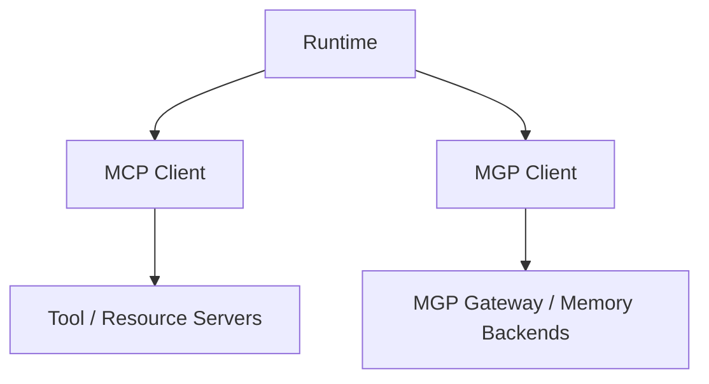

# MGP vs MCP

This document explains the relationship between MGP and MCP.

## The Short Version

- **MCP** is for tools and resources
- **MGP** is for governed persistent memory

They are peer protocols, not parent and child.

## Side-By-Side Comparison

| Dimension | MCP | MGP |
|-----------|-----|-----|
| **Focus** | Tool & resource connectivity | Governed persistent memory |
| **Protocol surface** | Tool invocation, prompt templates, resource discovery | Memory CRUD, policy context, audit, lifecycle, conflict resolution |
| **Data model** | Tools, prompts, resources | Memory objects, candidates, recall intents, audit events |
| **Governance** | Not in scope | Policy context on every request, access control hooks |
| **Lifecycle** | Not in scope | Expire, revoke, delete, purge — each with distinct semantics |
| **Audit** | Not in scope | Built-in audit trail and lineage tracking |
| **Retention** | Not in scope | TTL, retention policies, expiration enforcement |
| **Architecture level** | Runtime ↔ external capabilities | Runtime ↔ memory backends |
| **Relationship** | Peer protocol | Peer protocol |

## Architectural Relationship

MCP and MGP sit at the same architectural level.

## What MCP Governs

MCP standardizes how runtimes connect to:

- tools
- prompts
- resources

Its strength is interoperability around external capabilities that the model or runtime may call during execution.

## What MGP Governs

MGP standardizes how runtimes interact with:

- memory objects
- memory lifecycle
- policy context
- retention and revocation
- conflicts
- audit and lineage

Its strength is governed memory interoperability.

## Practical Guidance

Use MCP when the runtime needs to:

- call tools
- read resources
- interact with external capabilities

Use MGP when the runtime needs to:

- recall memory
- write persistent memory
- apply memory governance
- honor return modes, redaction behavior, and audit behavior

## Can a Runtime Use Both?

Yes. In fact, that is the expected long-term shape for advanced agent runtimes.

Example:

- use MCP to call a calendar tool
- use MGP to remember the user's long-term scheduling preferences

## What MGP Is Not

MGP is not:

- an MCP extension
- an MCP transport profile
- a wrapper around MCP tools

## What MCP Is Not

MCP is not:

- a memory governance protocol
- a replacement for lifecycle, retention, or audit semantics

## One-Line Heuristic

Use **MCP for action**, use **MGP for memory**.
