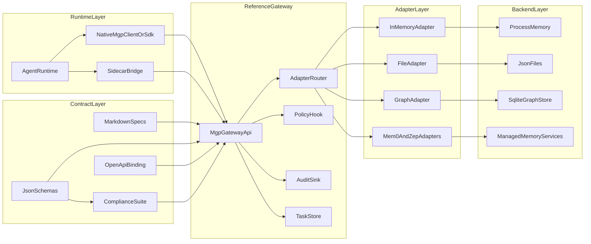

# Project Overview

MGP (Memory Governance Protocol) is an open protocol for governed memory in AI systems. It standardizes canonical memory objects, runtime memory operations, policy context, lifecycle semantics, auditability, and adapter capability declaration across heterogeneous memory backends.

**Protocol Version: v0.1.1**

**Looking for a quick start?** Head to [Getting Started](getting-started.md) to go from zero to running governed memory in five minutes. This page focuses on goals, architecture, and repository modules.

## Why MGP Exists

Agent runtimes already have a growing ecosystem for tools and resources, but persistent memory remains fragmented across vendor-specific APIs, backend-specific data models, and inconsistent governance behavior. A runtime that wants to work with file-backed memory, graph-backed memory, or managed memory services still has to absorb incompatible contracts for object shape, search behavior, lifecycle, access policy, and audit.

MGP defines a common contract for governed memory without becoming a memory store itself.

## What MGP Is

- a protocol for governed memory objects and memory operations
- a shared contract for policy context, lifecycle, conflict, and audit hooks
- a compatibility layer between runtimes and heterogeneous memory backends
- a foundation for schemas, reference implementations, adapters, SDKs, and compliance testing

## What MGP Is Not

- not a memory database
- not a hosted service or SaaS
- not a UI console
- not an agent framework
- not a vendor-specific memory SDK
- not a sub-protocol of MCP

## Relationship To MCP

MGP is a peer protocol to MCP. MCP standardizes how runtimes connect to tools and resources. MGP standardizes how runtimes govern and access persistent memory. They are complementary and can coexist in the same runtime, but one does not sit underneath the other.

See [MGP vs MCP](mgp-vs-mcp.md) for details.

## Architecture At A Glance

## Repository Modules

| Path | Role | Main assets |
| --- | --- | --- |
| `spec/` | Human-readable protocol source of truth | core operations, lifecycle, async, versioning, governance semantics |
| `schemas/` | Machine-readable protocol contracts | memory objects, request and response envelopes, capabilities, tasks |
| `openapi/` | HTTP binding contract | `mgp-openapi.yaml` |
| `reference/` | Runnable Python reference gateway | FastAPI app, validation, policy hook, audit sink, async task store |
| `adapters/` | Backend normalization layer | in-memory, file, graph, PostgreSQL, OceanBase, LanceDB, Mem0, and Zep adapters plus manifests |
| `compliance/` | Protocol verification | pytest suite for schema, lifecycle, search, audit, adapters, and interop |
| `sdk/python/` | Runtime-facing client | `MGPClient`, `PolicyContextBuilder`, search and candidate helpers |
| `integrations/` | Runtime adoption paths | sidecar bridge, harness, tests, and concrete runtime integration paths |
| `docs/` | Curated documentation site | overview pages, architecture, protocol map, implementation guides |
| `examples/` | Runnable end-to-end examples | write, search, expiry, backend switching, and full flow demos |

## Protocol Surface

Core memory operations:

- `WriteMemory`
- `SearchMemory`
- `GetMemory`
- `UpdateMemory`
- `ExpireMemory`
- `RevokeMemory`
- `DeleteMemory`
- `PurgeMemory`
- `AuditQuery`

Required support surfaces:

- capability discovery through `GET /mgp/capabilities`

Optional protocol profiles:

- lifecycle initialization through `POST /mgp/initialize`
- interop operations through `/mgp/write/batch`, `export`, `import`, `sync`, and task polling

Interpretation rule:

- `spec/` defines semantic meaning
- operation-specific schemas under `schemas/` define the exact machine-readable body shape
- `openapi/mgp-openapi.yaml` mirrors the HTTP binding and should stay aligned with both

## Design Boundaries

- MGP governs persistent and semi-persistent memory interactions.
- MGP does not define prompt assembly, model selection, ranking algorithms, or vendor-internal policy engines.
- MGP standardizes protocol contracts rather than forcing one backend architecture.
- MGP remains complementary to MCP rather than subordinate to it.
