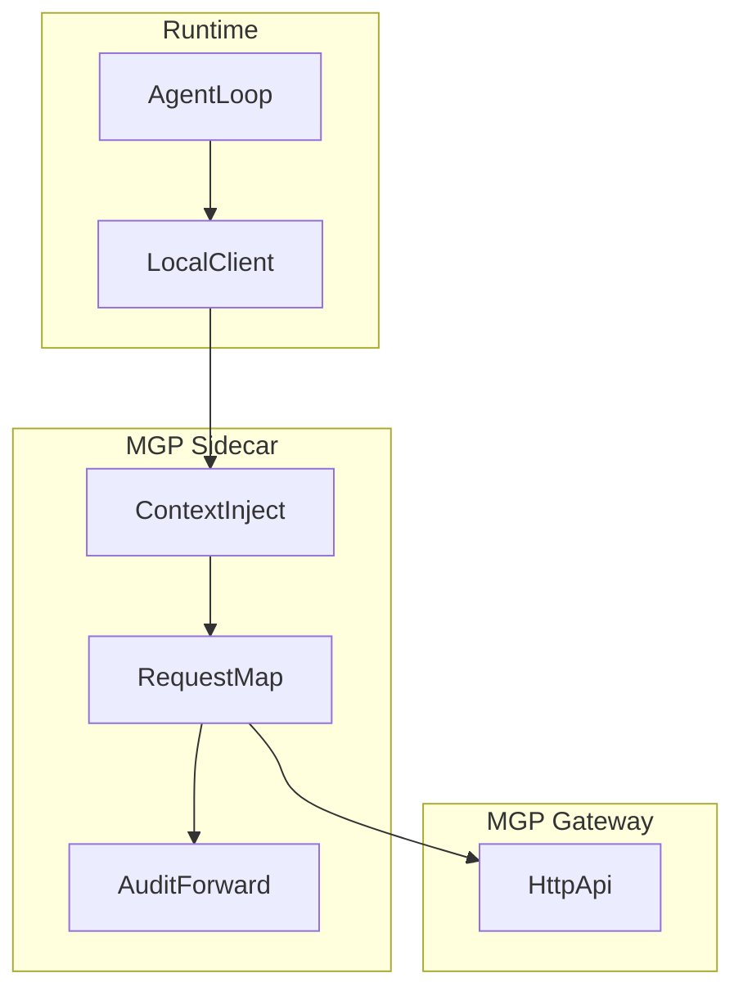

# Sidecar Integration

This document explains how a runtime can integrate MGP through a sidecar rather than a native SDK.

## What a Sidecar Means Here

An MGP sidecar is a companion process that sits next to the runtime and handles:

- request shaping
- policy context injection
- gateway forwarding
- audit forwarding support

The runtime talks to the sidecar with a simpler local contract, and the sidecar speaks full MGP to the gateway.

This page describes the generic sidecar pattern, not a standardized sidecar wire protocol. For the concrete repository reference path, inspect `integrations/nanobot/README.md`.

## When to Use a Sidecar

Use a sidecar when:

- the runtime is hard to modify internally
- you want a low-risk rollout path
- multiple runtimes should share one MGP integration layer
- you want policy context enrichment outside the runtime codebase

Use a native SDK when:

- you control the runtime internals
- you want full request lifecycle visibility inside the runtime
- you want fewer moving parts

## Fastest Concrete Path

If you want to connect a real runtime with the least ambiguity:

1. Read this page for the generic sidecar responsibilities and rollout model.
2. Start the reference gateway with `make serve`.
3. Run `make test-integrations` to validate the sidecar-facing tests in this repository.
4. Use `integrations/nanobot/README.md` for the concrete harness, demo, and external-runtime validation flow.

## Sidecar Responsibilities

- inject `policy_context`
- generate `request_id`
- forward requests to the MGP gateway
- normalize errors back to the runtime
- optionally forward audit metadata or runtime correlation IDs
- support staged rollout modes such as `off`, `shadow`, and `primary`

## Architecture

## Policy Context Injection

The sidecar should enrich requests with:

- `actor_agent`
- `acting_for_subject`
- `tenant_id`
- `task_id`
- `task_type`
- `risk_level`

Mapping note:

- use `task_id` for runtime workflow or execution correlation
- do not confuse it with the protocol async task object used by `/mgp/tasks/get` and `/mgp/tasks/cancel`
- keep `session_id` for conversation identity when the runtime has both concepts

Possible sources:

- runtime process metadata
- session store
- request headers from an upstream application
- local config

## Rollout Modes

Sidecar adoption should be staged instead of immediate cutover.

- `off`: do not call MGP; preserve runtime behavior exactly
- `shadow`: call MGP, but do not feed recall into the prompt or runtime decision path
- `primary`: call MGP and allow usable recall to influence prompt construction

Recommended rollout order:

1. sidecar-only validation
2. runtime proof of concept on a minimal entrypoint such as `integrations/minimal_runtime/`
3. `shadow` mode in a real session
4. `primary` mode after quality and latency checks

Related repository paths:

- `integrations/nanobot/` for the concrete sidecar reference path
- `integrations/minimal_runtime/` for the smallest copyable runtime bridge
- `integrations/langgraph/` for a mainstream framework-shaped state integration sketch

## Fail-Open Requirement

For early integrations, the sidecar should fail open:

- `SearchMemory` failure should not block the user reply
- `WriteMemory` failure should not break turn persistence
- sidecar unavailability should fall back to the runtime's native memory path

## Audit Forwarding

The runtime may emit its own trace or correlation identifiers that are useful to preserve.

The sidecar can:

- add those identifiers to `request_id`
- inject them into sidecar-local logs
- associate them with gateway audit output

## Recommended Request Flow

1. Runtime sends a local memory intent to the sidecar.
2. Sidecar resolves runtime state into `policy_context`.
3. Sidecar builds a valid MGP request envelope.
4. Sidecar forwards the request to the MGP gateway.
5. Sidecar translates the response into a runtime-friendly local result.

## Non-Goals

This document does not define:

- a sidecar wire protocol
- service mesh integration
- sidecar deployment tooling

## Concrete Reference: Nanobot

The repository ships a concrete sidecar reference under [`integrations/nanobot/`](https://github.com/HKUDS/MGP/tree/main/integrations/nanobot). That directory documents two integration paths:

- **Path A** — `nanobot[mgp]` extra: the in-tree always-on `recall_memory` tool plus automatic Consolidator/Dream commit. This is the production path for end users.
- **Path B** — runtime patch harness: patches stock unmodified Nanobot at runtime with `off / shadow / primary` rollout modes. Used by MGP CI and for staged validation.

Both paths map onto the generic sidecar responsibilities described above. Read [`integrations/nanobot/README.md`](https://github.com/HKUDS/MGP/blob/main/integrations/nanobot/README.md) for adapter selection (postgres / oceanbase / lancedb / mem0 / zep), embedding configuration for LanceDB, subject-id derivation, and operational notes.
