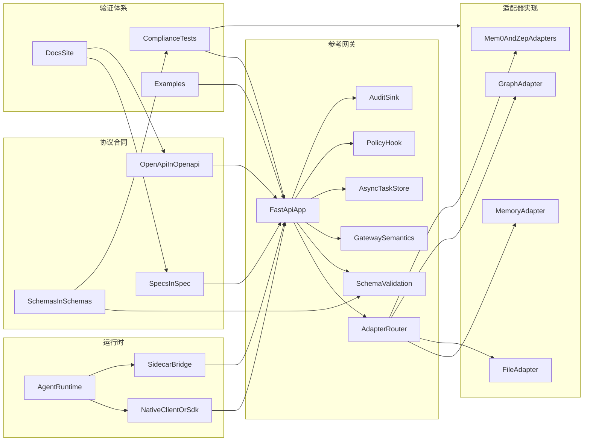
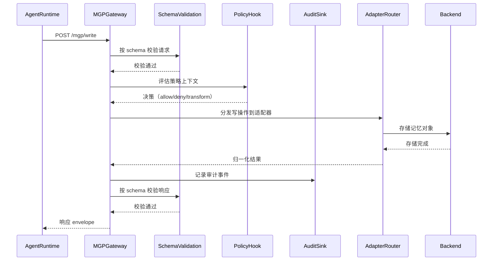

# 架构说明

本页把 MGP 的协议层次与仓库中的实际目录一一对应起来，方便从「文档结构」直接落到「代码位置」。

## 分层视图

## 仓库映射

| 层次 | 仓库路径 | 作用 |
| --- | --- | --- |
| 协议语义层 | `spec/` | 定义行为语义、术语和兼容性边界 |
| 机器可读合同层 | `schemas/`、`openapi/` | 定义 JSON 校验规则与 HTTP 绑定面 |
| 可运行网关层 | `reference/gateway/`、`reference/policy/`、`reference/audit/` | 实现 FastAPI 参考服务、policy hook、audit sink 与 async task 支持 |
| 后端归一化层 | `adapters/` | 把不同后端统一映射到 MGP adapter contract |
| 运行时接入层 | `sdk/python/`、`integrations/nanobot/` | 提供客户端 helper 与第一条运行时接入参考路径 |
| 验证层 | `compliance/`、`examples/` | 用测试和可运行示例证明协议行为 |
| 正式文档层 | `docs/`、`README.md`、`README.zh.md` | 解释系统结构，并引导读者定位正确的源码 |

## 参考请求流

下面的序列图展示了一个典型的 `WriteMemory` 请求如何流经参考网关：

逐步说明：

1. Runtime 通过原生 client 或 sidecar bridge 调用 MGP。
2. 参考网关按已发布 schema 校验请求。
3. 网关通过 policy hook 评估策略上下文。
4. Adapter router 把操作分发给当前选中的 adapter。
5. Adapter 把协议请求映射到具体后端模型，并返回归一化结果。
6. Audit sink 记录该操作。
7. 响应经校验后返回。

## 为什么要这样分层

这个仓库刻意把协议文字、schema、可运行代码和测试分开，是为了保证每一层都有清晰的 source of truth：

- `spec/` 负责解释协议「是什么意思」。
- `schemas/` 与 `openapi/` 负责约束「合法消息长什么样」。
- `reference/` 与 `adapters/` 负责展示「代码里如何实现这些行为」。
- `compliance/` 负责证明「实现是否真的符合合同」。
