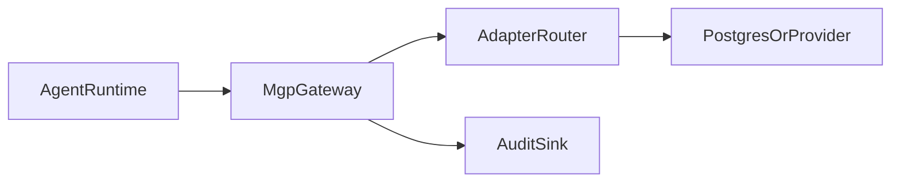

# 部署指南

本页总结 MGP 参考网关的几种主要部署方式。

## 部署形态

### 本地源码路径

适合：

- 协议开发
- adapter 编写
- 调试 reference behavior

命令：

```bash
make install
make serve
```

### 已安装包路径

适合：

- 较轻量的内部部署
- 想使用 CLI 入口而不想把整套仓库工作流带进去的环境

命令：

```bash
python3 -m pip install .
mgp-gateway --host 127.0.0.1 --port 8080
```

### 容器路径

适合：

- demo
- 本地集成环境
- 简单的 CI smoke deployment

命令：

```bash
docker compose up --build
```

## Adapter 选择

关键环境变量：

- `MGP_ADAPTER`
- `MGP_FILE_STORAGE_DIR`
- `MGP_GRAPH_DB_PATH`
- `MGP_POSTGRES_DSN`

推荐起点：

- `memory`：本地调试
- `file`：简单持久化演示
- `postgres`：生产导向的自管理基线
- `mem0` 或 `zep`：当部署本身就依赖这些 provider

## 安全与访问

关键网关选项：

- `MGP_GATEWAY_AUTH_MODE`
- `MGP_GATEWAY_API_KEY`
- `MGP_GATEWAY_BEARER_TOKEN`
- `MGP_GATEWAY_TENANT_HEADER`
- `MGP_GATEWAY_REQUIRE_TENANT_HEADER`

部署层的最低要求见 [安全基线](security-baseline.md)。

## Readiness 检查

运维端点：

- `GET /healthz`
- `GET /readyz`
- `GET /version`

可以用于：

- 启动检查
- 编排系统的 readiness probe
- 运维侧查看当前运行中的 gateway 版本与 adapter

## 推荐生产拓扑



## 升级建议

升级前建议：

1. 先查看最近一次发布说明或交接说明。
2. 运行 `make lint`。
3. 运行 `make test-all`。
4. 再补跑与你的 adapter 或 runtime 相关的专项测试。
