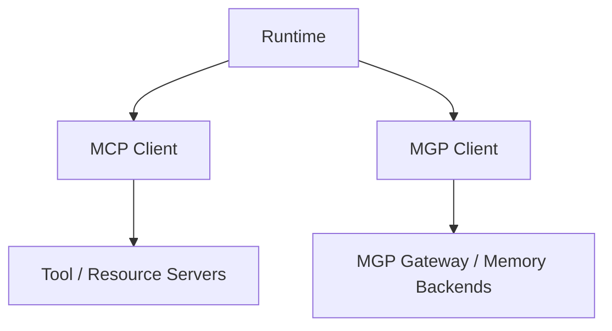

# MGP 与 MCP

本页说明 MGP 与 MCP 的关系。

## 简短结论

- **MCP** 面向 tools 与 resources
- **MGP** 面向 governed persistent memory

两者是并列协议，不是父子协议。

## 对照表

| 维度 | MCP | MGP |
|------|-----|-----|
| **关注点** | 工具与资源连接 | 受治理持久化记忆 |
| **协议面** | 工具调用、提示词模板、资源发现 | 记忆 CRUD、策略上下文、审计、生命周期、冲突解决 |
| **数据模型** | 工具、提示词、资源 | 记忆对象、候选项、召回意图、审计事件 |
| **治理** | 不在范围内 | 每个请求都携带策略上下文，内置访问控制钩子 |
| **生命周期** | 不在范围内 | Expire、Revoke、Delete、Purge——各有独立语义 |
| **审计** | 不在范围内 | 内建审计追踪与血缘关系 |
| **保留策略** | 不在范围内 | TTL、保留策略、过期强制执行 |
| **架构层级** | 运行时 ↔ 外部能力 | 运行时 ↔ 记忆后端 |
| **关系** | 对等协议 | 对等协议 |

## 架构关系

MCP 与 MGP 处于同一架构层。

## MCP 负责什么

MCP 标准化 runtime 如何连接：

- tools
- prompts
- resources

它擅长解决的是运行时对外部能力的调用与访问。

## MGP 负责什么

MGP 标准化 runtime 如何处理：

- memory object
- memory lifecycle
- policy context
- retention 与 revocation
- conflict
- audit 与 lineage

它擅长解决的是 governed memory interoperability。

## 实用判断

当 runtime 需要下面这些能力时，优先考虑 MCP：

- 调用工具
- 读取资源
- 与外部能力交互

当 runtime 需要下面这些能力时，优先考虑 MGP：

- recall memory
- 写入持久化 memory
- 应用 memory governance
- 处理 return mode、redaction 和 audit 相关行为

## 运行时可以同时使用两者吗

可以，而且这正是高级 agent runtime 的长期形态。

例如：

- 用 MCP 调用日历工具
- 用 MGP 记住用户的长期排程偏好

## MGP 不是什么

MGP 不是：

- MCP 的 extension
- MCP 的 transport profile
- MCP tool 的 wrapper

## MCP 不是什么

MCP 不是：

- memory governance protocol
- lifecycle、retention 或 audit 语义的替代品

## 一句话记忆

**MCP 负责 action，MGP 负责 memory。**
