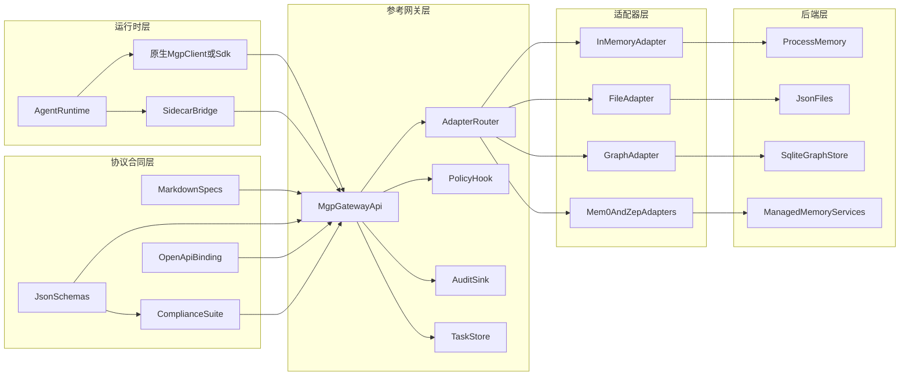

# 项目概览

MGP（Memory Governance Protocol）是一个面向 AI 系统的开放协议，用来统一受治理记忆的对象模型、运行时操作、策略上下文、生命周期语义、审计能力，以及适配器能力声明。它的目标不是再造一个存储引擎，而是在不同运行时与不同记忆后端之间建立稳定、可验证、可互操作的协议层。

**协议版本：v0.1.0**

**想快速上手？** 前往 [快速入门](getting-started.md)，五分钟内跑通第一组 governed memory 操作。本页聚焦项目目标、架构和仓库模块说明。

## 为什么需要 MGP

运行时现在已经有越来越成熟的工具与资源生态，但持久化记忆依然高度碎片化。一个运行时如果想同时接入文件型记忆、图结构记忆、或托管记忆服务，往往必须自己吸收不同系统对对象结构、搜索行为、生命周期、访问策略和审计模型的差异。

MGP 的作用，就是在这些异构实现之间定义统一的 governed memory contract，同时又不把自己变成一个 memory store。

## MGP 是什么

- 一个面向受治理记忆对象与记忆操作的协议
- 一个统一的 policy context、lifecycle、conflict、audit 合同
- 一个运行时与异构记忆后端之间的兼容层
- 一个为 schema、reference implementation、adapter、SDK 与 compliance testing 服务的协议基础

## MGP 不是什么

- 不是 memory database
- 不是 hosted service 或 SaaS
- 不是 UI 控制台
- 不是 agent framework
- 不是厂商私有 memory SDK
- 不是 MCP 的子协议

## 与 MCP 的关系

MGP 与 MCP 是并列关系。MCP 解决工具与资源连接，MGP 解决持久化记忆的治理与访问。两者可以在同一个 runtime 中并存，但互不从属。

详见 [MGP 与 MCP](mgp-vs-mcp.md)。

## 架构总览

## 仓库模块说明

| 路径 | 作用 | 主要内容 |
| --- | --- | --- |
| `spec/` | 协议语义的文字规范源 | core operations、lifecycle、async、versioning、治理语义 |
| `schemas/` | 机器可读协议合同 | memory object、请求响应 envelope、capabilities、tasks |
| `openapi/` | HTTP 绑定定义 | `mgp-openapi.yaml` |
| `reference/` | 可运行的 Python 参考网关 | FastAPI app、validation、policy hook、audit sink、task store |
| `adapters/` | 后端归一化层 | in-memory、file、graph、PostgreSQL、LanceDB、Mem0、Zep 适配器与 manifest |
| `compliance/` | 协议验证层 | schema、lifecycle、search、audit、adapter、interop 的 pytest 套件 |
| `sdk/python/` | 运行时客户端层 | `MGPClient`、`PolicyContextBuilder`、search 与 candidate helper |
| `integrations/` | 运行时接入路径 | sidecar bridge、harness、tests，以及具体 runtime 接入参考路径 |
| `docs/` | 面向读者的正式文档站点 | overview、architecture、protocol map、implementation guides |
| `examples/` | 可运行示例 | write、search、expiry、backend switch、end-to-end demo |

## 协议面

核心记忆操作包括：

- `WriteMemory`
- `SearchMemory`
- `GetMemory`
- `UpdateMemory`
- `ExpireMemory`
- `RevokeMemory`
- `DeleteMemory`
- `PurgeMemory`
- `AuditQuery`

必需的支撑面：

- `GET /mgp/capabilities` 的 capability discovery

可选协议增强层：

- `POST /mgp/initialize` 的 lifecycle initialize
- `/mgp/write/batch`、`export`、`import`、`sync` 及 task polling 的 interop 能力

解释顺序建议：

- `spec/` 负责定义语义
- `schemas/` 下的 operation-specific schema 负责定义精确的 machine-readable body shape
- `openapi/mgp-openapi.yaml` 负责映射 HTTP binding，并应与前两层保持一致

## 设计边界

- MGP 只治理 persistent 与 semi-persistent memory interaction
- MGP 不定义 prompt 组装、模型选择、排序算法，也不定义厂商内部策略引擎
- MGP 标准化的是协议合同，而不是强制一种后端架构
- MGP 与 MCP 互补，但相互独立
