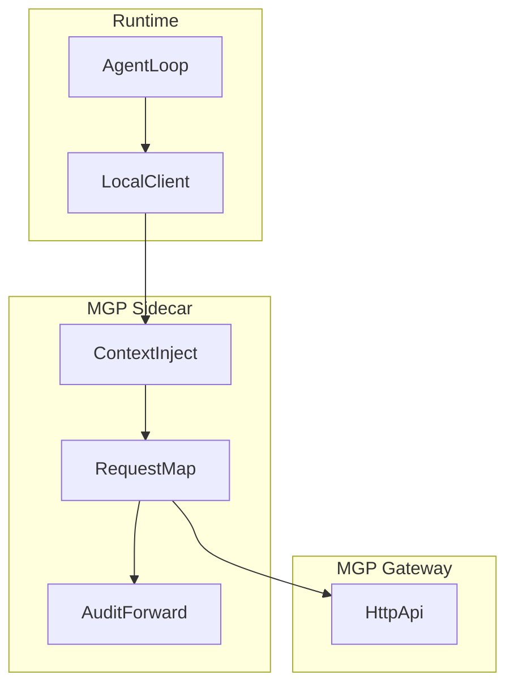

# Sidecar 接入

本页说明 runtime 如何通过 sidecar，而不是原生 SDK，接入 MGP。

## 这里的 Sidecar 是什么

MGP sidecar 是一个伴随 runtime 运行的进程，它负责：

- request shaping
- policy context 注入
- gateway forwarding
- audit 相关透传

runtime 只和 sidecar 交互一个更简单的本地合同，而 sidecar 负责对外讲完整的 MGP。

本页讲的是通用 sidecar 模式，不是标准化的 sidecar wire protocol。仓库里的具体参考路径请看 `integrations/nanobot/README.md`。

## 什么时候适合用 Sidecar

当出现下面情况时，sidecar 更合适：

- runtime 内部难以修改
- 你希望采用低风险接入路径
- 多个 runtime 需要共享同一层 MGP integration
- 你希望把 policy context enrichment 放在 runtime 代码外部

当出现下面情况时，原生 SDK 更合适：

- 你能直接控制 runtime 内部实现
- 你希望在 runtime 内看到完整请求生命周期
- 你希望减少系统组件数量

## 最短落地路径

如果你想以最少歧义把一个真实 runtime 接到 MGP：

1. 先读本页，理解 sidecar 的通用职责与 rollout 模式。
2. 用 `make serve` 启动参考网关。
3. 运行 `make test-integrations`，先验证仓库内的 sidecar 相关测试。
4. 再到 `integrations/nanobot/README.md` 按具体 harness、demo 与外部 runtime 验证流程继续推进。

## Sidecar 的职责

- 注入 `policy_context`
- 生成 `request_id`
- 把请求转发给 MGP gateway
- 把 MGP error 归一化回 runtime
- 视需要透传 audit metadata 或 runtime correlation ID
- 支持 `off`、`shadow`、`primary` 这类分阶段 rollout mode

## 架构

## Policy Context 注入

sidecar 应为请求填充以下字段：

- `actor_agent`
- `acting_for_subject`
- `tenant_id`
- `task_id`
- `task_type`
- `risk_level`

映射说明：

- `task_id` 用来承载 runtime 内部的 workflow / execution correlation
- 不要把它和 `/mgp/tasks/get`、`/mgp/tasks/cancel` 使用的协议异步任务对象混为一谈
- 如果 runtime 同时有业务会话概念，应继续使用 `session_id` 表达会话身份

来源可以是：

- runtime 进程元数据
- session store
- 上游应用的 request header
- 本地配置

## Rollout 原则

推荐采用逐步接入：

- `off`：不调用 MGP，保持 runtime 原有行为
- `shadow`：调用 MGP，但不把 recall 注入 prompt 或 runtime 决策路径
- `primary`：调用 MGP 并允许可用的 recall 影响 prompt 组装

推荐顺序：

1. sidecar-only validation
2. 先做一个最小入口的 runtime proof of concept，例如 `integrations/minimal_runtime/`
3. 真实会话中的 `shadow` mode
4. 质量和延迟可接受后再进入 `primary`

仓库内可以配合阅读的路径：

- `integrations/nanobot/`：具体 sidecar 参考路径
- `integrations/minimal_runtime/`：最小可拷贝的 runtime bridge
- `integrations/langgraph/`：主流框架形状的 state integration 示例

## Fail-Open 要求

在早期接入阶段，sidecar 应遵循 fail-open 原则：

- `SearchMemory` 失败不应阻塞回复
- `WriteMemory` 失败不应破坏 turn persistence
- sidecar 不可用时，应优先回退到 runtime 原生记忆路径

## Audit 透传

runtime 可能会产出自己的 trace 或 correlation ID，sidecar 可以：

- 把这些标识写入 `request_id`
- 注入 sidecar 本地日志
- 关联到 gateway audit 输出

## 推荐请求流程

1. Runtime 向 sidecar 发送本地 memory intent。
2. Sidecar 把 runtime 状态解析为 `policy_context`。
3. Sidecar 构造合法的 MGP request envelope。
4. Sidecar 将请求转发到 MGP gateway。
5. Sidecar 将响应翻译为 runtime 友好的本地结果。

## 非目标

本页不定义：

- sidecar wire protocol
- service mesh 集成
- sidecar 部署工具
