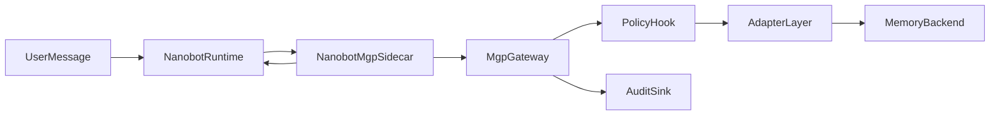
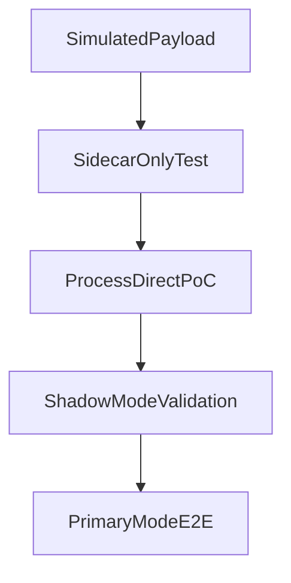

# Nanobot Reference Integration

This directory contains the reference integration assets for connecting MGP to the [Nanobot](https://github.com/HKUDS/nanobot) agent runtime.

Use this README together with `docs/sidecar-integration.md`: that page explains the generic sidecar pattern, while this directory is the concrete repository reference path.

## Why Nanobot

Nanobot is a useful integration target because it already has the runtime shape MGP needs to validate:

- it is a real agent host
- it already speaks MCP for tools and resources
- it has a concrete memory system, but not a peer protocol for governed memory

This makes it a good proving ground for MGP as a runtime-facing protocol.

## Repository Boundary

MGP keeps the integration assets in-tree under `integrations/nanobot/`. Nanobot stays as an external checkout in a sibling directory.

Recommended local layout:

```text
workspace/
  MGP/
  nanobot/
```

Rules:

- do not copy the Nanobot source tree into MGP
- do not add Nanobot as a subtree or vendor directory
- keep Nanobot as the external runtime under test

## What Lives Here

- `sidecar/` — the minimal Nanobot-oriented MGP bridge code
- `harness/` — the runtime patch layer for `process_direct()` validation
- `tests/` — mapping, mode behavior, and fail-open safety tests
- `fixtures/` — sample runtime and memory payloads
- `demo/` — simulated payload demo and `process_direct()` validation notes

Notable sidecar assets:

- `sidecar/service.py` — synchronous sidecar with reusable client support
- `sidecar/async_service.py` — async variant for event-loop based runtimes
- `sidecar/telemetry.py` — logging-oriented telemetry hook

## Architecture



## Integration Approach

The integration uses a sidecar bridge pattern rather than replacing Nanobot's native memory system:

- Nanobot's existing memory pipeline remains intact
- MGP provides governed memory recall alongside native memory
- MGP provides governed memory commit with audit trails
- the integration can be rolled out incrementally from shadow to primary mode

The harness patches two Nanobot hooks:

- `ContextBuilder.build_system_prompt()` — appends governed recall output to the system prompt when mode is `primary`
- `AgentLoop._save_turn()` — triggers best-effort governed commit after the native turn-save path runs

The harness also wraps `build_messages()` and `_process_message()` so the current message, sender, session key, and channel metadata are available when building MGP requests.

## Policy Context Mapping

The sidecar maps Nanobot runtime state into MGP policy context:

| Nanobot source | MGP field |
| --- | --- |
| agent identity | `actor_agent` |
| current user or chat subject | `acting_for_subject` |
| session key | `task_id` |
| invocation kind (`process_direct`, channel turn) | `task_type` |
| workspace or explicit tenant | `tenant_id` |

Interpretation note:

- the Nanobot session key is mapped to `task_id` as runtime execution correlation
- this is distinct from the protocol async task identifier returned by `/mgp/tasks/get`
- keep `session_id` available separately if you later need explicit conversation identity in policy context

## Rollout Modes

- `off`: no MGP calls, Nanobot behavior remains unchanged
- `shadow`: call MGP, but do not inject recall results into the prompt
- `primary`: call MGP and inject usable recall results into the prompt

Safety rules:

- fail open when the sidecar or gateway is unavailable
- never block a reply because `SearchMemory` fails
- never break session persistence because `WriteMemory` fails

Operational note:

- the sidecar now supports reusable gateway clients for long-running processes
- call `sidecar.close()` during runtime shutdown if client reuse is enabled

## Validation Ladder

The integration is validated in stages:



1. **Sidecar-only tests** — validate mapping and fail-open behavior without Nanobot
2. **`process_direct()` PoC** — validate against a real Nanobot invocation
3. **Shadow mode** — call MGP in production but do not inject recall
4. **Primary mode** — allow MGP recall to influence prompts

## Quickstart

Shortest path through this reference integration:

1. Run `make install` from the repository root.
2. Start the reference gateway with `make serve`.
3. Run `make test-integrations`.
4. Run the simulated payload demo.
5. Move on to the external Nanobot harness flow in `shadow` mode.

Install dependencies from the MGP repository root:

```bash
make install
```

Run the sidecar unit tests:

```bash
make test-integrations
```

Run the simulated payload demo against the local reference gateway:

```bash
MGP_BASE_URL=http://127.0.0.1:8080 ./.venv/bin/python integrations/nanobot/demo/simulated_payload_demo.py
```

## External Nanobot Validation

For real runtime validation, keep Nanobot in a sibling checkout:

```bash
ls ../nanobot
```

Run the harness CLI with Nanobot's Python 3.11+ environment:

```bash
../nanobot/.venv/bin/python integrations/nanobot/harness/cli.py \
  "Please remember that I prefer concise replies." \
  --mode shadow \
  --gateway-url http://127.0.0.1:8080 \
  --user-id demo-user \
  --nanobot-root ../nanobot
```

Notes:

- use Nanobot's own virtualenv or another Python 3.11+ environment
- `shadow` mode is the default rollout path; move to `primary` only after recall quality is acceptable
- prefer `--user-id` for cross-session recall tests so subject identity is stable

## Real Provider Validation

For real validation, use an isolated Nanobot config outside the repository:

- config file under `~/.nanobot-mgp-openrouter/`
- `providers.openrouter.apiKey` in that external config
- `agents.defaults.provider = "openrouter"`

This keeps provider credentials out of the repository. For the full validation sequence, see `demo/process_direct_shadow.md`.
