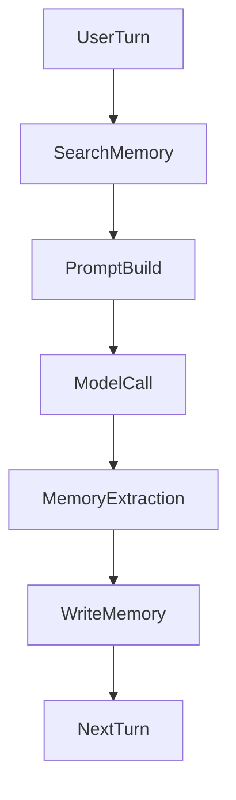

# Runtime Client

This document defines the runtime-side contract for `MGP v0.1`.

## Purpose

MGP is not only a backend protocol. Agent runtimes must know:

- how to construct `policy_context`
- when to call memory operations
- how to interpret governed responses
- how to propagate task, session, and tenant information

This document defines the minimum client-side expectations for a runtime that wants to integrate MGP correctly.

Interpretation note:

- this document describes recommended runtime behavior layered on top of the wire protocol
- it does not redefine the canonical request or response shapes from `schemas/`
- prompt assembly strategy remains runtime-local even when the protocol exposes prompt-safe fields such as `consumable_text`

## Runtime Responsibilities

An MGP-aware runtime should:

- construct a valid `policy_context` for every request
- generate a unique `request_id`
- choose the correct operation for the current step in the agent loop
- interpret `return_mode` and `redaction_info` before exposing memory to the model
- prefer `consumable_text` over raw `memory.content` when building prompts
- surface protocol errors explicitly rather than swallowing them

## Lifecycle Initialization

Before relying on protocol-level negotiation, a runtime should call:

- `POST /mgp/initialize`

This is especially recommended when the runtime needs to know:

- which protocol version was chosen
- which profiles were negotiated
- which protocol capabilities are available
- which effective runtime-facing features are safe to use

A runtime may skip `initialize` for baseline CRUD-style operations, capability discovery, and audit query when it does not depend on negotiated versions, negotiated capabilities, or profile-gated behavior.

## Runtime Capability Declaration

Machine-readable schema:

- `schemas/runtime-capabilities.schema.json`

A runtime may declare its own capabilities during initialize using:

- `runtime_capabilities`

Typical runtime declarations include whether the runtime can handle:

- `consumable_text`
- `redaction_info`
- mixed `return_mode` values
- `partial_failure`
- search explanations
- prompt-safe views

The initialize response may then return:

- `protocol_capabilities`
- `negotiated_capabilities`

For `MGP v0.1.1`, these negotiated fields describe whether the runtime can correctly consume the response-side features already defined by the protocol. They do not imply that core response fields such as `consumable_text` can be omitted from the wire contract.

Runtimes should use these negotiated outputs to avoid assuming every implementation or profile supports the same advanced behavior.

## Constructing Policy Context

Every operation request must carry a `policy_context`.

Minimum fields:

- `actor_agent`
- `acting_for_subject`
- `requested_action`

Recommended additional fields when available:

- `task_id`
- `session_id`
- `task_type`
- `tenant_id`
- `data_zone`
- `risk_level`
- `channel`
- `chat_id`
- `runtime_id`
- `runtime_instance_id`
- `correlation_id`
- `consent_basis`
- `assertion_origin`

### Mapping Runtime State to Policy Context

| Runtime state | MGP field |
| --- | --- |
| Runtime or agent ID | `actor_agent` |
| Current user | `acting_for_subject` |
| Session ID | `acting_for_subject` or `task_id` depending on scope |
| Session identity for tracing | `session_id` |
| Workflow or tool invocation type | `task_type` |
| Tenant / workspace | `tenant_id` |
| Sensitivity or elevated action hint | `risk_level` |
| Channel or transport | `channel` |
| Chat target | `chat_id` |
| Runtime process or deployment | `runtime_id` / `runtime_instance_id` |
| Trace correlation | `correlation_id` |

## When to Call Each Operation

### `SearchMemory`

Use before generation when the runtime wants to recall prior governed memory relevant to the current user, task, or context.

Typical timing:

- before composing the main model prompt
- before tool selection if memory should influence decisions

### `GetMemory`

Use when the runtime already knows a specific `memory_id` and needs the authoritative current version.

Typical timing:

- after selecting a specific search result
- during follow-up inspection of a prior memory reference

### `WriteMemory`

Use after the runtime extracts a stable memory candidate from user input, tool output, or another trusted source.

Typical timing:

- after a turn is complete
- after a structured extraction step
- after a confirmed profile or preference update

Preferred flow:

1. runtime produces a `MemoryCandidate`
2. runtime decides a merge strategy
3. runtime sends canonical memory or candidate + merge hint through `WriteMemory`

### `UpdateMemory`

Use when the runtime knows that an existing memory object should be modified rather than replaced blindly.

Typical timing:

- after conflict-aware correction
- after explicit user revision of known memory

### `ExpireMemory`

Use when the runtime or governance layer decides the memory should no longer be treated as active.

Typical timing:

- after task completion
- after explicit lifecycle cleanup

### `RevokeMemory`

Use when a memory should be withdrawn from normal use due to correction, removal, or governance policy.

Typical timing:

- user requests deletion or withdrawal
- policy-driven removal

## Handling Return Modes

Governed responses may not always return raw memory.

### `raw`

The runtime may use the returned memory object normally.

### `summary`

The runtime should treat the content as a reduced representation and should not assume the full original payload is available.

### `masked`

The runtime may use the object, but should assume sensitive fields were transformed or hidden.

### `metadata_only`

The runtime should not use the object as semantic memory content. It may only use metadata such as identifiers, type, timestamps, and other explicitly safe metadata.

In `MGP v0.1.1`, implementations may still return a schema-valid canonical memory object with placeholder `content` so the result remains machine-valid. Runtimes must treat that placeholder content as non-semantic metadata, not as recallable truth.

## Handling `consumable_text`

When present, `consumable_text` is the preferred runtime-facing memory rendering for prompt injection and user-visible recall.

Recommended runtime behavior:

- use `consumable_text` for prompt augmentation
- use `memory.content` only when the runtime explicitly needs the richer object structure
- treat `metadata_only` `consumable_text` as non-semantic metadata

## Handling `redaction_info`

When `redaction_info` is present, the runtime should:

- avoid assuming the memory content is complete
- preserve the metadata if it passes the result downstream
- avoid re-writing redacted values back as if they were raw truth

## Error Handling

Runtimes should handle MGP errors explicitly:

- `MGP_INVALID_OBJECT`: caller bug or malformed request
- `MGP_POLICY_DENIED`: runtime lacks permission for the requested action
- `MGP_MEMORY_NOT_FOUND`: memory reference is stale or invalid
- `MGP_CONFLICT_UNRESOLVED`: runtime should choose another resolution path or human review
- `MGP_BACKEND_ERROR`: retry or fallback may be appropriate

## Correlation and Observability

Every runtime request should generate a unique `request_id`.

Recommended usage:

- log the `request_id` with runtime traces
- associate memory requests with user-visible actions
- use the same `request_id` to debug gateway and audit logs
- propagate `correlation_id` when the runtime already has one

## Runtime Candidate Contract

Machine-readable schema:

- `schemas/memory-candidate.schema.json`

See also:

- `spec/runtime-write-candidate.md`

Runtimes should prefer a candidate stage when:

- memory extraction is heuristic
- evidence or confirmation is still being accumulated
- dedupe / merge policy needs to be explicit

## Reference Flow

## Non-Goals

This document does not define:

- memory extraction algorithms
- prompt engineering strategy
- model selection
- runtime orchestration internals
